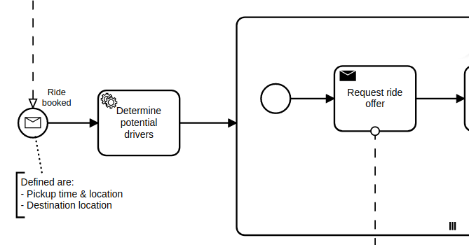
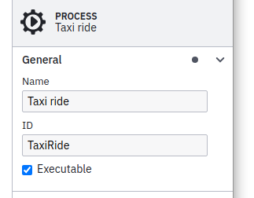
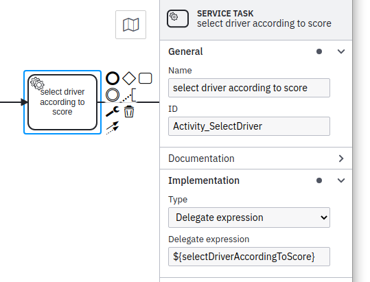
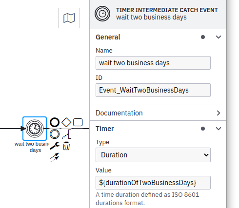
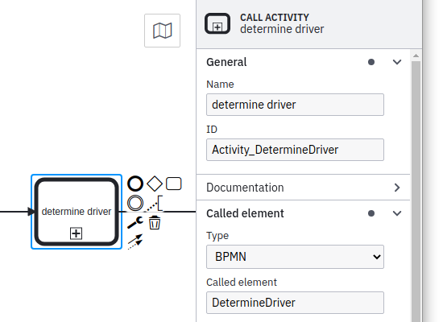
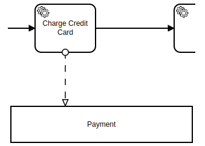
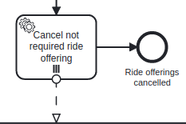
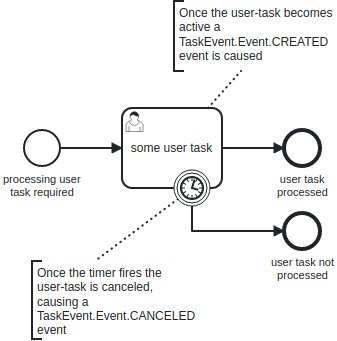

*Vanilla BP* is **an aspect orientated service provider interface (SPI) for workflow systems as a Java developer would expect it to be**.

The SPI was developed as part of the [Taxi Ride Blueprint](https://github.com/phactum/taxiride-blueprint) which is a demo of how to implement Java based business processing software using state-of-the-art techniques. Therefore, examples shown in this README are about building a taxi ride business process implementation.

*Heads up:* If you want to learn about the things we had in mind creating this SPI then don't miss to also read the [About the SPI](#about-the-spi) section afterwards :wink:. It also includes links to [available adapters](#available-adapters) to use this SPI with an existing workflow system.

## Content

1. [How it looks like](#how-it-looks-like)
1. [Usage](#usage)
    1. [Process-specific workflow-aggregate](#process-specific-workflow-aggregate)
    1. [Start a workflow](#start-a-workflow)
    1. [Wire up a process](#wire-up-a-process)
    1. [Wire up a task](#wire-up-a-task)
    1. [Wire up an expression](#wire-up-an-expression)
1. [Advanced topics](#advanced-topics)
    1. [Natural ids](#natural-ids)
    1. [Process variables](#process-variables)
    1. [Correlate an incoming message](#correlate-an-incoming-message)
    1. [Versioning of BPMN business-processes](#versioning-of-bpmn-business-processes)
    1. [Call-activities](#call-activities)
    1. [Multi-instance](#multi-instance)
    1. [User tasks and asynchronous tasks](#user-tasks-and-asynchronous-tasks)
1. [About the SPI](#about-the-spi)
    1. [Prerequisites](#prerequisites)
    1. [Motivation](#motivation)
    1. [Goals](#goals)
    1. [Available Adapters](#available-adapters)
    1. [Concept](#concept)
1. [Noteworthy & Contributors](#noteworthy--contributors)
1. [License](#license)

## How it looks like

This is a section of a taxi ride workflow and should give you an idea of how the Vanilla BP SPI is used in your business code:

  
*Screenshot of [Camunda Modeler](https://camunda.com/en/download/modeler/)*

```java
@Service
@WorkflowService(workflowAggregateClass = Ride.class)
@Transactional(noRollbackFor = TaskException.class)
public class TaxiRide {
    
    @Autowired
    private ProcessService<Ride> processService;
    
    public String rideBooked(
            final Location pickupLocation,
            final OffsetDateTime pickupTime,
            final Location targetLocation) {
        
        final var ride = new Ride();
        ...
        // start the workflow by correlation of the message start event
        return processService
                .correlateMessage(ride, "RideBooked")
                .getRideId();
    }
    
    @WorkflowTask
    public void determinePotentialDrivers(
            final Ride ride) {
        
        final var parameters = new DriversNearbyParameters()
                .longitude(ride.getPickupLocation().getLongitude())
                .latitude(ride.getPickupLocation().getLatitude());

        final var potentialDrivers = driverService
                .determineDriversNearby(parameters);

        ride.setPotentialDrivers(
                mapper.toDomain(potentialDrivers, ride));
    }

    @WorkflowTask
    public void requestRideOfferFromDriver(
            final Ride ride,
            @MultiInstanceIndex("RequestRideOffer")
            final int potentialDriverIndex) {
        
        final var driver = ride.getPotentialDrivers().get(potentialDriverIndex);
        
        driverService.requestRideOffer(
                driver.getId(),
                new RequestRideOfferParameters()
                        .rideId(ride.getRideId())
                        .pickupLocation(mapper.toApi(ride.getPickupLocation()))
                        .pickupTime(ride.getPickupTime())
                        .targetLocation(mapper.toApi(ride.getTargetLocation())));
        
    }
    ...
```

## Usage

### Process-specific workflow-aggregate

Typically, you have data needed to fulfill the purpose of the workflow. This might be values like customer ID, order ID or in case of the taxi ride the pickup time, the pickup location and the target location:

```java
@Entity
@Table(name = "RIDES")
@Getter
@Setter
public class Ride {
  @Id
  private String rideId; // see section "Natural ids"
  private OffsetDateTime pickupTime;
  private String pickupLocation;
  private String targetLocation;
  private boolean customerCharged;
}
```

This data has a 1:1 relationship to a particular workflow (a running instance of a BPMN process). The Vanilla BP SPI uses a dedicated JPA entity per workflow for storing those values. This entity might be split up into a couple of sub-entities (many-to-many, one-to-many, many-to-one relations and embedded objects) but the root of that entity-tree is the record connected to the workflow. In terms of DDD this entire tree is called *an aggregate*.

### Start a workflow

There is a ready-to-use service bean available called `ProcessService`. It is a generic bean using the workflow aggregate's class as a generic parameter and can be injected in any Spring component:

```java
    @Autowired
    private ProcessService<Ride> rideService;
```

To start a workflow we can use it as part of a typical bean method which my be called due to a business event (e.g. user hits a button):

```java
    public void rideBooked(RideRequest request) {
         // use the request to initialize the aggregate
         var ride = new Ride(request);
         // start the process
         rideService.startProcess(ride);
    }
```

### Wire up a process

Starting a workflow or correlating a message (explained in the [Advanced topics](#correlate-an-incoming-message) section) are actions originated in our custom business code typically triggered by some kind of business event (e.g. user hits a button). Wiring a process, a task or an expression is about connecting BPMN elements to our software components. In these situations the action to run our business code is initiated by the workflow system. So, we have to introduce markers to let the engine know where to find the right code to run.

We introduce a name based approach for the binding in an aspect-oriented style. As a basis for this binding the BPMN process-id is used:

  
*Screenshot of [Camunda Modeler](https://camunda.com/en/download/modeler/)*

#### Software-first approach

Developers might want to use a BPMN and a BPMN-engine to improve readability or maintainability of their software since this takes a lot of coding away. In this situation the service bean might be created upfront.

Use the service's class-name as the process BPMN's process-id to wire up the component to the process by simply adding the `@WorkflowService` annotation:

```java
@Component
@WorkflowService(workflowAggregateClass = Ride.class)
public class TaxiRide {
  ...
}
```

The mandatory annotation attribute `workflowAggregateClass` references the class used as workflow-aggregate of this workflow.

#### BPMN-first approach

In case of a given BPMN file the component needs to be mapped by setting the `bpmnProcess` attribute if it is not the same string as the class-name:

```java
@Component
@WorkflowService(
        workflowAggregateClass = Ride.class,
        bpmProcess = @BpmnProcess(bpmnProcessId = "Process_TaxiRide")
    )
public class TaxiRide {
  ...
}
```

If the service-bean becomes huge due to the number of tasks of the workflow then multiple service-beans can be annotated with the same `@WorkflowService` annotation. The only precondition for this is to avoid duplicate task wiring. However, if there is a method wired twice this will be detected on startup and reported by throwing an exception.

### Wire up a task

Similar to [wiring a process](#wire-up-a-process) an aspect-oriented approach is used for the task binding. This applies to service tasks, send tasks, business rule tasks and user tasks.

  
*Screenshot of [Camunda Modeler](https://camunda.com/en/download/modeler/)*

The `@WorkflowTask` annotation is used to mark a method responsible for certain BPMN task:

```java
@WorkflowTask
public void selectDriverAccordingToScore(Ride ride) {
  ...
}
```

#### Software-first approach

In this situation for the name of the BPMN task definition the name of the method has to be used (e.g. `selectDriverAccordingToScore`) as shown in the screenshot above:

```java
@WorkflowTask
public void selectDriverAccordingToScore(Ride ride) {
  ...
}
```

#### BPMN-first approach

If the BPMN is given, then the name used in the BPMN can be mapped by the annotation attribute `taskDefinition` if it does not match the method's name:

```java
@WorkflowTask(taskDefinition = "SELECT_DRIVER")
public void selectDriverAccordingToScore(Ride ride) {
  ...
}
```

as an alternative the task can be wired by the task's BPMN id:

```java
@WorkflowTask(id = "Activity_SelectDriver")
public void selectDriverAccordingToScore(Ride ride) {
  ...
}
```

#### Workflow-aggregate argument

```java
@WorkflowTask
public void selectDriverAccordingToScore(Ride ride) {
  ...
}
```

As mentioned in section [Process-specific workflow-aggregate](#process-specific-workflow-aggregate) for each workflow a JPA entity-record is used as a workflow-aggregate. So, whenever a service-method is called there is one parameter accepted: The workflow-aggregate providing values of the current workflow.

*Hint:* These workflow task methods do not return any value because they operate on the given data from the workflow-aggregate and also store new data in the workflow-aggregate if necessary. So, just change the field values of the aggregate as the [BPMS-specific adapter](../adapters/README.md#engine-adapters) used will take care of persisting these changed values.

### Wire up an expression

There are two major situations in which expressions are used:

1. A path decision has to be taken (exclusive gateway, inclusive gateway, conditional flows)   
*Screenshot of [Camunda Modeler](https://camunda.com/en/download/modeler/)*

1. A value needs to be calculated (e.g. x business-days as a timer-event definition)   
*Screenshot of [Camunda Modeler](https://camunda.com/en/download/modeler/)*

The expression specified in the BPMN will be used to retrieve the value from the workflow-aggregate by using a getter or, if there is not getter, by accessing the named field. In case of the getter the result can also be computed on-the-fly:

```java
@Entity
@Table(name = "RIDES")
public class Ride {
    ...
    private boolean customerCharged;
    ...
    public boolean isCustomerCharged() {
       return customerCharged;
    }
    ...
    public String getDurationOfTwoBusinessDays() {
        var holidays = HolidayManager.getInstance(HolidayCalendar.AUSTRIA);
        var nextBusinessDay = Instant.now();
        while (holidays.isHoliday(nextBusinessDay) {
            nextBusinessDay = nextBusinessDay.plus(1, ChronoUnits.DAYS);
        }
        return Duration.between(Instant.now, nextBusinessDay).toString();
    }
}
```

*Hint:* Each [BPMS-specific adapter](../adapters/README.md#engine-adapters) implements this *magic* to redirect attribute references in BPMN expressions to the proper getter of your workflow-aggregate.

## Advanced topics

### Process variables

If you are familiar with any workflow system then you might know about process-variables you can use to store information the workflow needs to fulfill decisions like at sequence-flow conditions. As shown in upper sections the Vanilla BP SPI does not use process-variables but makes the workflow system [use the workflow-aggregate instead](#wire-up-an-expression):

  
*Screenshot of [Camunda Modeler](https://camunda.com/en/download/modeler/)*

Reasons for not using process-variables:

1. BPMN
    1. Process variables have no schema and therefore they cannot be documented and tested easily
    1. Using process variables, the "contract" between your BPMN model and your code can become quite intransparent
    1. No type-safety in regard to the information needed by the process
    1. Tight-coupling of the code and the business process definition
1. Operation of workflows
    1. Historic process-variables need to be cleaned up in order not to exhaust your database (even for cleaning-up itself!)
    1. Process-variables tend to pollute the execution context because typically they are not cleaned up by developers. The longer the process is running the more unused variables are stored.
    1. For call-activities, *all* process-variables are copied as a default, even including the temporary and unused variables mentioned above.
    1. Schema evolution: Process variables may have complex types and evolve over time. Migrating such values is a hard job.

### Natural ids

The aggregate uses a natural id as a primary key, so for one specific natural key a particular process started twice is identified as a duplicate and rejected.

A natural id is a primary key which uniquely identifies a single business-case. That might be an order-id, a trouble-ticket-id or or a checksum calculated based on the use-case's attributes.

This natural id has to be chosen wisely, because it is used to identify duplicate requests, which might occur in a distributed, fault-tolerant system. It is also fine to use an auto-increment/UUID but in this case de-duplication will not work.

### Correlate an incoming message

Some BPMN elements are meant to wait for external messages like receive tasks and message catch events. The content of the message is typically incorporated into the domain aggregate to be used by upcoming tasks.

However, the event of the incoming message is also used to make the workflow wake up and process whatever comes after the "sleeping" receive task. This mechanism is called message correlation and is based on the message's name registered for the receive task.

One can use the `ProcessService` to perform that message correlation:

```java
    @Autowired
    private RideRepositories rides;

    @Autowired
    private RideService<Ride> rideService;
    
    public void confirmRide(RideConfirmation message) {
         var ride = rides.get(message.getRideId());
         ride.setDriver(message.getDriverId());
         rideService.correlateMessage(ride, message);
    }
```

*Hint:* If the message correlates to a message start event, then a new workflow is created.

Additionally, if there are several receive tasks "waiting" for the same message then you need to define a correlation-id as a third parameter of `correlateMessage`.

### Versioning of BPMN business-processes

In case of doing breaking changes in BPMN over the time you can specify for which versions of BPMN this component is developed for:

```java
@Component
@WorkflowService(
        workflowAggregateClass = Ride.class,
        version = "<10"
    )
public class TaxiRide {
  ...
}
```

Valid formats:
* missing attribute: all versions
* '*': all versions
* '1': only version "1"
* '1-3': only versions "1", "2" and "3"
* '<3': only versions "1" and "2"
* '<=3': only versions "1", "2" and "3"
* '>3': only versions higher than "3"
* '>=3': only versions higher than or equal to "3"

*Heads up:* This feature is not yet implemented but already prepared in code. Fill your annotations
properly to benefit from it once it's available.

### Call-activities

In general BPMN models can be split up by using the "call-activity" task which is not meant to be executed by custom business code but instead is interpreted by the workflow system to spawn another process instance based on another BPMN.

There are two different situations in which you might want to split up the BPMN model into several smaller models:

#### 1. Decomposition - a call-activity is used to hide complexity

  
*Screenshot of [Camunda Modeler](https://camunda.com/en/download/modeler/)*

In this situation the workflow-aggregate entity created for the root workflow is also used for the workflows spawned by call-activities. The reason for this is, that one still could put the content of the call-activities BPMN into to parent BPMN (e.g. as an embedded subprocess).

As each call-activity's process is a section of fulfillment one may introduce a separate service bean bound to the same workflow-aggregate class:

```java
@Component
@WorkflowService(
        workflowAggregateClass = Ride.class,
        bpmnProcess = @BpmnProcess(bpmnProcessId = "DetermineDriver"))
public class DetermineDriver {
  ...
}
```

*Hint:* In this example the attribute `bpmnProcess` could be removed since the BPMN process-id is the same as the service's class-name ("convention over configuration").

But one can also decide to reuse the existing service-bean for the call-activity's process by simply adding another `@BpmnProcess` annotation:

```java
@Component
@WorkflowService(
        workflowAggregateClass = Ride.class,
        bpmProcess = @BpmnProcess(bpmnProcessId = "TaxiRide"),
        secondaryBpmnProcesses = @BpmnProcess(bpmnProcessId = "DetermineDriver"))
public class TaxiRide {
  ...
}
```

*Hint:* In this example the attribute `bpmnProcess` of the first `@BpmnProcess` annotation could be removed since the BPMN process-id is the same as the service's class-name ("convention over configuration").

#### 1. Reuse - a call-activity is used to reuse a section of a process by other processes, too

In this situation the call-activity's process is used in different contexts of different parent-processes. Therefore, also a separate workflow-aggregate has to be defined and used.

In order to support this notion the target process is not modeled as a call-activity but as a collapsed pool. Instead of a call-activity a service task is used in the BPMN.

```java
@Component
@WorkflowService(workflowAggregateClass = Payment.class)
public class ChargeCreditCard {
  ...
}
```

  
*Screenshot of [Camunda Modeler](https://camunda.com/en/download/modeler/)*

### Multi-instance

  
*Screenshot of [Camunda Modeler](https://camunda.com/en/download/modeler/)*

For multi-instance executions typically a lot of process variables are created automatically:

1. The current element of the collection
1. The number of index of the current element
1. The total number of elements

To avoid problems on serializing and deserializing elements:

1. Don't use collection values for multi-instance activities.
1. Use attribute `loop-cardinality` instead to simply define the number of iterations.
1. In case of dynamically changing collections use attribute `completionCondition`.
1. Fetch the current element on your own based on the current iteration's index.

Especially the last item is important: If you ask the process engine to handle the collection to retrieve the current element it might be that this is not done in the most efficient way, since the process engine does not know about the details of the underlying data (typically the workflow-aggregate). Therefore, it is better to fetch the element as part of the method the iteration is used for.

#### Tasks

In case of multi-instance the current element (for collection-based tasks), the current iteration's number and the total number of elements (for cardinality-based tasks) can be passed to any method called.

To announce which values you are interested in, add further method-parameters annotated by one of these annotations:
* `@MultiInstanceElement` to pass the current element
* `@MultiInstanceIndex` to pass the current iterations index
* `@MultiInstanceTotal` to pass the total number of iterations

*Cardinality-based:*

```java
@WorkflowTask
public void requestRideOfferFromDriver(Ride ride,
    @MultiInstanceIndex int index) {
  final var driver = ride.getDrivers().get(index);
  ...
}
```

*Collection-based:*

```java
@WorkflowTask
public void requestRideOfferFromDriver(Ride ride,
    @MultiInstanceElement String driverId) {
  ...
}
```

#### Embedded subprocesses

For multi-instance embedded-subprocesses the iteration is used at tasks within that embedded-subprocess. For method parameters annotated by `@MultiInstanceIndex`, `@MultiInstanceTotal` or  `@MultiInstance` the values of the first multi-instance parent activity are passed to the business method.

*Nested multi-instance activities*:

One can design processes having more than one multi-instance context active:
* Multi-instance task within a multi-instance embedded sub-process
* Multi-instance task within a multi-instance call-activity
* Task within a multi-instance call-activity within a multi-instance embedded-subprocess
* etc.

To handle these complex situations a `MultiInstanceElementResolver` bean can be specified as part of the annotation `@MultiInstanceElement`:

```java
@WorkflowTask
public void cancelRideOfferOfDriver(Ride ride,
    @MultiInstanceElement(resolver = DriverResolver.class) Driver driver) {
  ...
}
```

A Spring-bean implementing the resolver class is used to convert the current multi-instance execution-context into an object used by the business-method. Using this technique hides the complexity and makes it reusable for different activities within the same BPMN-context. A resolver has to implement the interface `MultiInstanceElementResolver`.

Example:

```java
@Component
public class DriverResolver implements MultiInstanceElementResolver<Ride, Driver> {
    @Autowired
    private DriversService drivers;
    
    public ProductLicense resolve(Ride ride,
            Map<String, MultiInstance<Object>> nestedMultiInstanceContext) {
            
        String driverId = nestedMultiInstanceContext
                .get("RequestRideOffer").getElement();
        String index = nestedMultiInstanceContext
                .get("CancelNotRequiredRide").getIndex();
        
        return drivers.getDriverByIdAndIndex(driverId, index);
    }
}
```

In this example the element of the collection based `RequestRideOffer` multi-instance embedded subprocess is used next to the index of the nested multi-instance `CancelNotRequiredRide`. Both values are passed to the internal `DriverService` to determine the required driver entity.

### User tasks and asynchronous tasks

#### Task id

A user task is a task which is fulfilled by a human. In terms of a BPMN-engine the engine stops and waits for human input (e.g. collected via a graphical user interface) to be reported via API. This procedure is the same as processing asynchronous service tasks (e.g. calling an external service which confirms after a while by calling a REST-endpoint).

In both situations one needs a reference id to be used to complete the task once the workload is done (either by a human or a service). This reference id, also called `task-id`, is handed over by using the `@TaskId` annotation:

```java
@WorkflowTask
public void retrievePayment(
        final Ride ride,
        final @TaskId String taskId) {
    ride.setRetrievePaymentTaskId(taskId);
}
```

*Heads up:* If the task-id is used in a workflow-task's method which is not able to be processed asynchronously then `null` is passed as a value (e.g. not a user-task or the BPMN-engine does not support asynchronous tasks).

#### Task event

According to the life-cycle of asynchronous tasks there are two situations in which one might to get informed by the engine:

  
*Screenshot of [Camunda Modeler](https://camunda.com/en/download/modeler/)*

A `@TaskEvent` annotated parameter can be used to mark a method to be called in one or in both situations. Depending on whether a `@TaskEvent` annotated parameter is given and [it's value](./src/main/java/io/vanillabp/spi/service/TaskEvent.java), the workflow-method is called on each event:

* `@TaskEvent(TaskEvent.Event.CREATED)`: The workflow-method is called only when the task is created.
* `@TaskEvent(TaskEvent.Event.CANCELED)`: The workflow-method is called only when the task is canceled (e.g. due to interrupting boundary events). It can be used to unset a task-id previously stored (e.g. `ride.setRetrievePaymentTaskId(null)`).
* `@TaskEvent(TaskEvent.Event.ALL)`: The workflow-method is called two times each for `CREATED` and `CANCELED`. The default behavior for the `@TaskEvent` annotation with no value given.
* No `@TaskEvent` annotation: The workflow-method is called only when the task is created.

#### Completing asynchronous tasks

On the `CREATED` event in case of a user task for example a workflow-method could send a notification to the user. In case of an asynchronous task the external service has to be called. The given task-id has to be stored to be used once the asynchronous task completes to make the BPMN-engine know the which task is done.

In this example the task is completed by using the previously received task-id:

```java
@RestController
public class DriverGuiController {
    @Autowired
    private ProcessService<Ride> rideService;
    @Autowired
    private RideRepository rides;
    @RequestMapping(
            method = RequestMethod.GET,
            value = "/gui/ride/{rideId}/payment")
    public void completePayment(
            @PathVariable("rideId") String rideId,
            @RequestBody RideCharged rideCharged) {
        final var ride = rides.findById(rideId);
        ride.setChared(rideCharged.getAmount());
        rideService.complete(ride, ride.getRetrievePaymentTaskId());
    }
}
```

## About the SPI

## Prerequisites

You should know about [BPMN](https://en.wikipedia.org/wiki/Business_Process_Model_and_Notation) and you should be able to create meaningful models using a [modeler tool](https://camunda.com/en/download/modeler/).

*If you are not familiar with BPMN:* BPMN is a graphical representation for specifying business processes in XML also including semantic information. A BPMN engine runs those processes and acts as a state engine. This helps to dramatically reduce the amount of code since only "tasks" need to be implemented and the flow is handled by the engine. Hang on to see this in action.

Additionally, it helps to know about the basics of aspect orientated development. You don't have to be able to implement your own aspects but you should be aware of that annotations are used to place provided aspects in your code. Your code will be scanned for those annotations on starting the application and afterwards enriched behind the scenes to fulfill the meaning of the annotation.

### Motivation

Each BPMN engine, also called Business Processing Management System (BPMS) or workflow system, has its own APIs. Using a workflow system requires a developer to know the API and also to understand its paradigms. Typically, the API is not completely decoupled from the runtime environment which means that things like transactional behavior, synchronization of concurrent executions and similar has to be controlled by the business code but also affects the behavior of the workflow system.

So, the API *bleeds* into the business code and the business code effects the API and leads to:

- The BPMS' API is interwoven with the business code.
- All developers need to know about the APIs and their rules.
- The business code is less readable and therefore harder to maintain.
- Moving to other technology stacks/APIs (like from Camunda 7 to Camunda 8) requires to reimplement at least parts the business logic.

### Goals

To deal with the problems mentioned in section [Motivation](#motivation) we decided to introduce *VanillaBP*. This SPI incorporates best-practices collected as part of developing business-processing services since 2014 using various of those system. The provided implementation of the SPI is called adapter and hides all the details of the workflow system API. This lets the developer focus on the business aspects rather than technical details.

The SPI incorporates various state-of-the-art techniques and concepts to simplify business-process applications. We use Domain-Driven design aspects, loose-coupling, aspect-orientated programming and "convention over configuration" not only as buzz-words - as you will see in the upcoming sections - as they help to minimize the weaving between the BPMN and the business software.

### Available Adapters

An implementation of the SPI is called adapter and hides all the details of a particular workflow system's API. This lets the developer focus on the business aspects rather than technical details.

Available adapters:
* [Camunda 7 adapter](https://github.com/vanillabp/camunda7-adapter)
* [Camunda 8 adapter](https://github.com/vanillabp/camunda8-adapter)

### Concept

Imagine you have to implement the business processing software of a taxi ride.

*How will the code be structured?*

The base idea is to implement a small group of service beans which are responsible to implement all requirements of a particular business process.

If external services or components are required then those service beans act as a frontend for all of them to not bind third-party dependencies close to the BPMN. This will ensure that changes in those external dependencies will be highlighted by the compiler and not only at runtime.

*How many services do you need to implement?*

In the best case only one service bean is sufficient. One workflow implemented by one service bean!

In case of more complex processes typically sections of fulfillment can be identified (determine a driver, do the ride, handle payment, etc.) which can be used as semantical buckets mapped to separate service beans.

*How are those service beans wired to the BPMN?*

In terms of BPMN there are tasks (e.g. service-task, send-task, etc.) which are wired to methods of that service by name and there are expressions (e.g. conditional-flows) which are evaluated against a process-specific [workflow-aggregate](https://martinfowler.com/bliki/DDD_Aggregate.html) (see *How is data handled?*).

All those names used to wire tasks or expressions should be in a natural language camel-case style and therefore defined by the BPMN designer (BPMN-first approach) or upfront by the developer (software-first approach). This should on one hand force the BPMN designer to name the expected data/behavior and on the other hand help developers to understand what they have to implement. 

The sum of those names forms the contract between the BPMN and the underlying implementation. As an example these are typical names used as part of a taxi ride workflow:

- RideBooked (message name)
- determinePotentialDrivers (service task)
- requestRideOfferFromDriver (send task)
- noRideAvailable (aggregate field)
- customerCharged (aggregate field)

*How is data handled?*

A domain aggregate is used as a persistent entity to store data either required by the process to execute (e.g. as part of expressions) or by the underlying implementation to fulfill tasks. This aggregate does not keep all the data ever needed by the workflow but stores at least references to retrieve required values on demand.

If particular attributes are required often (e.g. nearly every task) then this aggregate can be used as a *cache* of the original source of data. Depending on the use-case one might has to implement a proper update strategy.

## Noteworthy & Contributors

VanillaBP was developed by [Phactum](https://www.phactum.at) with the intention of giving back to the community as it has benefited the community in the past.


Special thanks go to Martin Schimak, [plexiti GmbH](https://plexiti.com/about/), who inspired us to apply DDD to workflow.

## License

Copyright 2022 Phactum Softwareentwicklung GmbH

Licensed under the Apache License, Version 2.0
